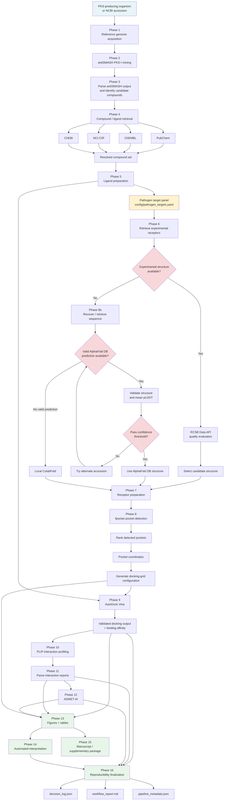

<div align="center">

# PKS_DOCK

### An Open-Source, Reference-Genome-Based Pipeline for Genome-Guided Natural-Product Discovery, Pocket-Aware Docking, and ADMET Screening

**Fully automated, evidence-documented *in silico* workflow from unsequenced bacterial isolate to confidence-graded candidate inhibitor.**

🔗 **Repository:** [github.com/kizito-devbio/PKS_DOCK](https://github.com/kizito-devbio/PKS_DOCK)
🐳 **Docker image:** [hub.docker.com/r/kizitodevbio/pks-dock](https://hub.docker.com/r/kizitodevbio/pks-dock)

[](LICENSE)
[](https://www.python.org/)
[](pyproject.toml)
[](https://github.com/kizito-devbio/PKS_DOCK)
[](https://github.com/kizito-devbio/PKS_DOCK/commits/main)
[](https://hub.docker.com/r/kizitodevbio/pks-dock)

</div>

---

## Table of Contents

- [Overview](#overview)
- [What Makes This a Platform, Not a Docking Script](#what-makes-this-a-platform-not-a-docking-script)
- [Architecture](#architecture)
- [Requirements](#requirements)
- [Installation](#installation)
- [Running with Docker](#running-with-docker)
- [Usage](#usage)
- [Pipeline Stages Reference](#pipeline-stages-reference)
- [AlphaFold Integration](#alphafold-integration)
- [Adding a New Pathogen or Target](#adding-a-new-pathogen-or-target)
- [Directory Structure](#directory-structure)
- [Outputs](#outputs)
- [Reproducibility & Provenance](#reproducibility--provenance)
- [Honest Limitations](#honest-limitations-please-read-before-you-present-this-to-your-supervisor)
- [Development & Testing](#development--testing)
- [Frequently Asked Questions](#frequently-asked-questions)
- [Roadmap](#roadmap)
- [Contributing](#contributing)
- [Acknowledgments](#acknowledgments)
- [License](#license)
- [Contact](#contact)

---

## Overview

PKS_DOCK connects **genome mining** with **structure-based computational drug discovery**.

The pipeline starts from a PKS-producing bacterial organism or genome accession, identifies Type-I PKS biosynthetic gene clusters using antiSMASH, resolves associated natural-product compounds through public chemical databases, prepares the resulting ligands for docking, and evaluates them against a configurable set of pathogen protein targets.

Where experimental pathogen structures are available, PKS_DOCK evaluates candidate structures from the RCSB Protein Data Bank and selects a structure using explicit quality criteria. Where a target lacks a usable experimental structure, the workflow can recover or retrieve its sequence, check AlphaFold DB for a validated prediction, and fall back to local ColabFold prediction when necessary.

The resulting structures are prepared, analyzed with `fpocket` for pocket detection, docked with AutoDock Vina, profiled with PLIP, evaluated with ADMET-AI, and converted into tables, figures, an automatically generated interpretation report, and a manuscript/supplementary package.

The pipeline is designed around one principle:

> **Automate the repetitive computational work while making important scientific decisions explicit, inspectable, and reproducible.**

It was built for, and is currently used in, exactly this situation: antimicrobial-producing bacterial isolates from Nigerian fermented foods and natural spring water, where sequencing every promising isolate simply isn't feasible before you need a first-pass computational answer.

---

## What Makes This a Platform, Not a Docking Script

Most reference-genome docking workflows are a straight line: pick a genome, run antiSMASH, dock whatever comes out. PKS_DOCK instead makes an explicit, logged decision at each stage about what evidence is actually available, rather than assuming a fixed happy path:

| Decision point | Naive approach | What PKS_DOCK does |
| --- | --- | --- |
| Reference genome selection | Pick the first hit on NCBI | Resolves the organism name via NCBI Assembly search and picks the best available reference/representative assembly automatically (Phase 1) |
| Compound identity | Assume every antiSMASH cluster is a known compound | Only clusters with a literature-supported match are treated as named compounds; unannotated clusters are never silently promoted to named ligands |
| Ligand structure retrieval | One API call, hope it works | PubChem PUG-REST first, ChEBI's real structure-download endpoint and NCI CIR as genuine fallbacks, all through one retrying HTTP client |
| Docking target definition | Center the box by eye, or on a stripped ligand | `fpocket` pocket detection ranks druggability and derives the grid box from the real top-pocket coordinates (Phase 8/8b) |
| Receptor structure | Always predict from scratch | Checks AlphaFold DB for an existing prediction by UniProt accession first; only falls back to local ColabFold if nothing exists (Phase 6b) |
| Interaction reporting | A handful of hydrogen bonds | All 8 PLIP interaction types: hydrogen bonds, hydrophobic contacts, salt bridges, water bridges, π-stacking, π-cation interactions, halogen bonds, metal complexes |
| Result trust | Terminal output, gone after the run | `decision_log.json`, `workflow_report.md`, and `pipeline_metadata.json` written automatically, even on partial failure |

---

## Architecture

The diagram below is the real control flow implemented across `scripts/01_fetch_genome.py` through `scripts/16_generate_reproducibility_report.py`, orchestrated by `run_pipeline_container.sh` and exposed as the `pks-dock` CLI.



> Every box maps to a real script in `scripts/`, not an illustrative simplification — the branches shown (experimental vs. predicted structure, AlphaFold DB hit vs. miss, confidence threshold) are actual decision points in the pipeline, each one logged to `decision_log.json` as it happens.

---

## Requirements

**Hardware**
- 8+ CPU cores recommended (AutoDock Vina parallelizes automatically)
- 8 GB RAM minimum; 16 GB+ recommended for larger receptors
- Developed and tested on a Dell Precision 5530 (12-core, 32 GB RAM) running WSL2/Ubuntu

**Software**
- Python 3.10, 3.11, or 3.12
- [Miniconda](https://docs.conda.io/en/latest/miniconda.html) or Anaconda (recommended route — see below)
- Docker Engine 24+ (optional, only if running via container)
- Git

---

## Installation

**1. Clone the repository**

```bash
git clone https://github.com/kizito-devbio/PKS_DOCK.git
cd PKS_DOCK
```

**2. Create and activate the Conda environment**

```bash
conda env create -f environment.yml
conda activate pksdock
```

This resolves the full scientific stack — antiSMASH, AutoDock Vina, Open Babel, fpocket, PLIP, ProDy, RDKit, Meeko, OpenMM, PDBFixer, ADMET-AI, and Biopython — and also installs the `pks-dock` package itself (`pip install -e .`, declared in `environment.yml`), giving you the `pks-dock` CLI described below.

If you're not using Conda, `pip install -e ".[dev]"` from the repo root installs the Python package and development tooling on their own — but the heavier scientific tools (antiSMASH, Vina, fpocket, PLIP) still need to be available on your system separately in that case.

**3. Verify the environment**

```bash
pks-dock --version
python -c "import prody, meeko, pdbfixer; print('OK')"
```

Before relying on this for a thesis chapter or publication, regenerate a real lock file from your own tested install rather than trusting `environment.yml`'s resolved versions blindly — package resolvers can substitute versions (for example, pip resolving a newer RDKit than the one Conda requested) even when the top-level spec looks pinned.

---

## Running with Docker

The published image bundles the entire scientific stack, including the antiSMASH reference databases, so there's nothing to download or configure beyond pulling the image.

### Option A — Pull the published image (fastest, recommended)

No clone, no build, no dependency resolution — just pull and run:

```bash
docker pull kizitodevbio/pks-dock:0.2.0
```

Then run the pipeline directly against the pulled image, mounting local `data/`, `results/`, and `logs/` directories so output persists on your host machine rather than disappearing with the container:

```bash
mkdir -p results logs

docker run --rm \
    -v "$(pwd)/results:/opt/PKS_DOCK/results" \
    -v "$(pwd)/logs:/opt/PKS_DOCK/logs" \
    kizitodevbio/pks-dock:0.2.0 \
    --organism "Bacillus velezensis" \
    --pathogens Staphylococcus_aureus Bacillus_cereus Pseudomonas_aeruginosa \
    --threads 8
```

If you've cloned the repository as well, the same pulled image can be driven through the launcher instead, which mounts the whole repo automatically so you don't have to specify volumes by hand:

```bash
PKS_DOCK_IMAGE=kizitodevbio/pks-dock:0.2.0 ./run_pipeline.sh \
    --organism "Bacillus velezensis" \
    --pathogens Staphylococcus_aureus
```

### Option B — Build the image yourself

```bash
git clone https://github.com/kizito-devbio/PKS_DOCK.git
cd PKS_DOCK
docker build -t pks-dock:0.2.0 .

./run_pipeline.sh \
    --organism "Bacillus velezensis" \
    --pathogens Staphylococcus_aureus Bacillus_cereus Pseudomonas_aeruginosa \
    --threads 8
```

`run_pipeline.sh` is a thin Docker launcher only — it locates the repository, ensures `results/` and `logs/` exist on the host, and passes your arguments straight into the container. The actual 16-phase scientific workflow lives in `run_pipeline_container.sh`, which does not itself call Docker and can also be run directly inside a correctly configured Conda environment (see [Installation](#installation)) if you'd rather not use Docker at all.

---

## Usage

Two equivalent ways to run the pipeline:

```bash
# 1) Installed CLI (recommended) — works from anywhere once `pip install -e .`
#    has run; finalizes results/reports/workflow_report.md and
#    pipeline_metadata.json even if a phase fails partway through
pks-dock --organism "Bacillus velezensis" \
    --pathogens Staphylococcus_aureus Bacillus_cereus Pseudomonas_aeruginosa \
    --threads 8

# 2) Docker launcher (must be run from inside the repo)
./run_pipeline.sh \
    --accession GCF_000063585.1 \
    --pathogens Staphylococcus_aureus \
    --threads 8
```

Every phase prints, in real time, what it's doing, why, and what it found. A full combined log is saved to `logs/pipeline_log_<timestamp>.txt`. Every automated decision — which reference genome, which PDB structure, which fallback database resolved a compound, whether AlphaFold DB already had a receptor prediction — is additionally written to:

- **`results/reports/decision_log.json`** — machine-readable, appended to incrementally as each phase runs, so it survives a crash partway through
- **`results/reports/workflow_report.md`** — the same decisions rendered as a human-readable, phase-by-phase narrative
- **`results/reports/pipeline_metadata.json`** — software version, git commit, Python/platform info, and the exact CLI parameters used for the run

---

## Pipeline Stages Reference

| Phase | Script | Function |
| --- | --- | --- |
| 1 | `01_fetch_genome.py` | Resolve organism name/accession to a reference genome via NCBI Assembly |
| 2 | `02_run_antismash.sh` | Run antiSMASH biosynthetic gene cluster mining |
| 3 | `03_parse_antismash.py` | Parse antiSMASH output, identify Type-I PKS clusters |
| 4 | `04_get_ligands.py` | Resolve named compounds (PubChem → ChEBI → NCI CIR) |
| 5 | `05_prep_ligands.sh` | Ligand preparation for docking |
| 6 | `06_get_receptors.py` | Resolve pathogen drug targets from `config/pathogen_targets.yaml`; fetch experimental structures |
| 6b | `06b_predict_receptors.py` | AlphaFold DB lookup by UniProt accession; local ColabFold fallback if no prediction exists |
| 7 | `07_prep_receptors.sh` | Receptor cleaning and preparation |
| 8 | `08_run_fpocket.sh` | Cavity/pocket detection on every prepared receptor |
| 8b | `08b_generate_grid_configs.py` | Derive docking grid center/size from the top-ranked pocket |
| 9 | `09_run_docking.sh` | AutoDock Vina docking |
| 10 | `10_run_plip.sh` | PLIP protein–ligand interaction profiling |
| 11 | `11_parse_plip.py` | Parse PLIP output — all 8 interaction types |
| 12 | `12_run_admet.py` | ADMET-AI pharmacokinetic and drug-property screening |
| 13 | `13_generate_figures.py` | Publication-ready figures (F1–F15, 300 DPI) |
| 14 | `14_generate_interpretation.py` | Prose Markdown interpretation report from the real result numbers |
| 15 | `15_generate_manuscript_package.py` | Manuscript/supplementary export |
| 16 | `16_generate_reproducibility_report.py` | Final `decision_log.json`, `workflow_report.md`, `pipeline_metadata.json` |

---

## AlphaFold Integration

Phase 6b (structure prediction for receptors with no experimental PDB) checks the [AlphaFold DB API](https://alphafold.ebi.ac.uk/api-docs) for an existing prediction for the resolved UniProt accession *before* running a new local ColabFold job. If AlphaFold DB has one, it's downloaded directly (with retries and caching via `pks_dock.net.HTTPClient`) and ColabFold is skipped entirely; if not, the pipeline says so explicitly and falls back to local prediction. Either way, the choice and the reason are written to `decision_log.json`.

---

## Adding a New Pathogen or Target

Edit `config/pathogen_targets.yaml`. Add a block with `candidate_pdb_ids` (the pipeline auto-selects the best one by resolution) or set `predict_if_empty: true` if no experimental structure exists, in which case the pipeline auto-fetches the sequence from UniProt and predicts with ColabFold. Always cite the source that validated the target as druggable — this file is the one intentionally human-curated part of the pipeline (see [Honest Limitations](#honest-limitations-please-read-before-you-present-this-to-your-supervisor)).

---

## Directory Structure

```
PKS_DOCK/
├── README.md
├── pyproject.toml                    <- installable `pks-dock` package (pip install -e .)
├── environment.yml
├── run_pipeline.sh                   <- Docker launcher (mounts repo, persists results/logs)
├── run_pipeline_container.sh         <- actual 16-phase scientific workflow (no Docker calls)
├── Dockerfile
├── LICENSE  CITATION.cff  CONTRIBUTING.md  CHANGELOG.md
├── .github/workflows/                <- lint + offline unit tests on every push/PR
├── src/pks_dock/                     <- installable package, shared across all phases
│   ├── net.py                        <- retry/backoff/caching HTTPClient + fallback_chain()
│   ├── alphafold.py                  <- real AlphaFold DB API integration
│   ├── reproducibility.py            <- DecisionLog, workflow_report.md, pipeline_metadata.json
│   └── cli.py                        <- `pks-dock` console-script entry point
├── config/
│   ├── pathogen_targets.yaml         <- target panels (human-curated, cited)
│   └── sequences/                    <- auto-fetched or manually supplied FASTA files
├── scripts/                          <- 01-16, see Pipeline Stages Reference above
├── results/                          <- all generated at runtime
│   ├── genomes/  antismash/  ligands/  ligands_pdbqt/
│   ├── receptors_raw/  receptors_pdbqt/  fpocket/  docking/  plip/  admet/
│   ├── figures/                      <- F1-F15, 300 DPI
│   ├── tables/                       <- Table01-Table05
│   └── reports/
│       ├── interpretation.md  decision_log.json
│       ├── workflow_report.md  pipeline_metadata.json
│       └── manuscript_package/
├── logs/                             <- timestamped full pipeline logs
├── cache/http/                       <- on-disk cache for retried API calls
├── tests/
│   ├── test_net.py                   <- retry/backoff/cache/fallback_chain unit tests
│   ├── test_alphafold.py             <- AlphaFold DB hit/miss/error unit tests
│   ├── test_reproducibility.py       <- decision log + report rendering unit tests
│   └── test_vina_parsing.sh          <- verifies the Vina log parsing fix
└── docs/
    └── DIRECTORY_STRUCTURE.md
```

---

## Outputs

A run produces layered, cross-referenced output rather than a single result file:

- **Figures** (`results/figures/`) — 15 publication-ready, 300 DPI figures (F1–F15)
- **Tables** (`results/tables/`) — 5 structured comparison tables (Table01–Table05)
- **Per-stage reports** (`results/reports/`) — including `interpretation.md`, a prose Markdown summary generated from the run's real numbers, not a template
- **Reproducibility artifacts** — `decision_log.json`, `workflow_report.md`, `pipeline_metadata.json`

---

## Reproducibility & Provenance

- **Environment** — `environment.yml` declares the full scientific stack; regenerate and pin a lock file from your own tested install before publishing results from it
- **Decision logging** — every automated choice (reference genome, named vs. unannotated compound, experimental vs. predicted structure, which pocket, which fallback database) is written to `decision_log.json` as it happens, not reconstructed after the fact
- **Human-readable narrative** — `workflow_report.md` renders the same decisions as a phase-by-phase story, suitable for a methods section or a supervisor review
- **Run provenance** — `pipeline_metadata.json` records software version, git commit, Python/platform info, and the exact CLI parameters used
- **Partial-failure safety** — reproducibility artifacts are finalized even if a phase fails partway through, so a broken run still leaves an auditable record of what completed

---

## Honest Limitations

1. **Pathogen target panels are config-driven, not auto-discovered.** There is no reliable API that returns "the validated druggable targets for organism X" — every published docking study picks targets based on literature justification, not automated mining. `config/pathogen_targets.yaml` is intentionally the one human-curated part of this pipeline. To add a new pathogen, add a block and cite your source for each target.
2. **Genome accession resolution from an organism name is automatic** (Phase 1, via NCBI Assembly search) and picks the best available reference/representative genome — but you should still sanity-check that the assembly it picked is the one you'd cite in your thesis.
3. **`fpocket`'s default pocket ranking is used as-is.** For receptors with multiple plausible pockets, visually inspect the top 2–3 pockets (`results/fpocket/<receptor>/pockets/`) rather than trusting the ranking blindly for a thesis defense.
4. **External bioinformatics tools (antiSMASH, ColabFold, AutoDock Vina, fpocket, PLIP, ADMET-AI) are not bundled or testable in a sandboxed code environment.** This repository's Python parsing logic was unit-tested against synthetic sample data (Vina logs, fpocket output), but a full end-to-end run should always be executed and checked against your own installed tool versions before trusting the results for a thesis chapter.
5. **AutoDock Vina scoring, like all empirical docking scoring functions, is an approximate ranking of binding poses, not a substitute for experimental binding assays** (e.g., MIC, ITC, SPR). Treat results as candidate prioritization, not confirmed inhibition.

---

## Development & Testing

```bash
pip install -e ".[dev]"
pytest tests/ -v          # offline unit tests: retries, caching, fallback
                           # chains, AlphaFold DB integration, decision log
ruff check src/ tests/
black --check src/ tests/
```

See `CONTRIBUTING.md` for the ground rules: no fabricated science, no new hardcoded IDs, every external call goes through `pks_dock.net.HTTPClient`, and every automated choice gets logged. `CHANGELOG.md` tracks what changes release to release.

---

## Frequently Asked Questions

**Does PKS_DOCK require the isolate's own genome to be sequenced?**
No — that's the specific problem it's built to work around. It resolves a defensible reference genome automatically and documents that choice, rather than requiring whole-genome sequencing of the isolate itself.

**What happens if an antiSMASH cluster doesn't match a known compound?**
It's left unannotated and reported as such. It is never silently treated as a named ligand or advanced through the docking stages under a compound identity it doesn't actually have.

**Can I add my own experimental PDB structure instead of relying on AlphaFold/ColabFold?**
Yes — list it under `candidate_pdb_ids` in `config/pathogen_targets.yaml`; the pipeline will select the best one by resolution automatically.

**Why does PKS_DOCK use `fpocket` instead of a learned pocket-prediction model?**
`fpocket` is deterministic, fast, and doesn't require GPU inference, which keeps the pipeline reproducible and runnable on modest hardware — the same reasoning behind `ResiDock`'s choice for the same problem.

**Is a docking score a probability of biological activity?**
No. It's an approximate ranking of predicted binding affinity from an empirical scoring function, not a statistical confidence interval or a measure of experimentally demonstrated inhibition.

---

## Roadmap

- Propagate per-residue AlphaFold/ColabFold confidence (pLDDT) into the docking-box confidence assessment
- Optional ensemble docking across multiple predicted conformations per receptor
- Expanded ligand-database cascade (e.g., DrugBank, BindingDB) as additional fallback sources
- Automated regression tests against reference docking results in CI

---

## Contributing

Contributions, issues, and pull requests are welcome. If you're planning a larger change (a new phase, a new fallback database, a new target-selection rule), please open an issue first to discuss the approach — this keeps the evidence-aware decision logic consistent across the codebase.

When submitting a PR:
1. Run the environment verification steps in [Installation](#installation) to confirm your setup matches `environment.yml`.
2. Include the relevant phase's report JSON (or a diff of expected fields) if your change affects pipeline output.
3. Document any new decision points in the same style as existing phases: explicit branch, explicit log entry, explicit provenance field.

---

## Acknowledgments

This pipeline was developed under the supervision of **Prof. Aemere Ogunlaja**, Redeemer's University, Nigeria, whose supervision of the underlying MSc thesis work shaped the scientific questions this pipeline was built to answer.

PKS_DOCK also orchestrates several established open-source scientific tools; credit for the underlying science belongs to their respective authors and communities:

- [antiSMASH](https://antismash.secondarymetabolites.org/) — biosynthetic gene cluster mining
- [AutoDock Vina](https://vina.scripps.edu/) — molecular docking engine
- [fpocket](https://github.com/Discngine/fpocket) — cavity and pocket detection
- [PLIP](https://github.com/pharmai/plip) — protein–ligand interaction profiling
- [ADMET-AI](https://github.com/swansonk14/admet_ai) — pharmacokinetic and drug-property prediction
- [AlphaFold2](https://github.com/google-deepmind/alphafold) / [ColabFold](https://github.com/sokrypton/ColabFold) — AI-predicted protein structures
- [RDKit](https://www.rdkit.org/), [Open Babel](https://openbabel.org/), [Meeko](https://github.com/forlilab/Meeko), [PDBFixer](https://github.com/openmm/pdbfixer), [ProDy](https://github.com/prody/ProDy) — structure preparation
- [Biopython](https://biopython.org/) — structural biology utilities

---

## License

MIT License. See [LICENSE](LICENSE) for details.

---

## Contact

**Kizito Ibeojo Sylvester-Ali**
Email: [kizitosylvesterali@gmail.com](mailto:kizitosylvesterali@gmail.com)
Repository: [github.com/kizito-devbio/PKS_DOCK](https://github.com/kizito-devbio/PKS_DOCK)

Contributions, issues, and pull requests are welcome.
