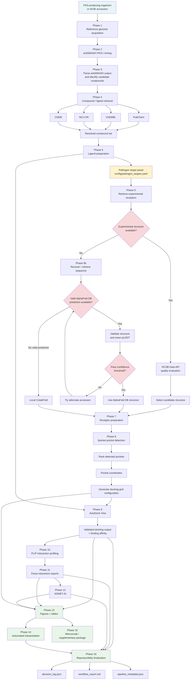

<div align="center">

# PKS_DOCK

### Genome-Guided Natural Product Discovery and Structure-Based Docking Pipeline

**An open-source, end-to-end computational workflow for Type-I polyketide synthase (PKS-I) biosynthetic gene-cluster mining, natural-product compound retrieval, structure preparation, pocket-aware molecular docking, protein–ligand interaction profiling, ADMET prediction, and reproducible scientific reporting.**

[](LICENSE)
[](https://www.python.org/)
[](pyproject.toml)
[](CHANGELOG.md)
[](https://github.com/kizito-devbio/PKS_DOCK/actions)
[](https://github.com/kizito-devbio/PKS_DOCK/stargazers)
[](https://github.com/kizito-devbio/PKS_DOCK/commits/main)

</div>

---

## Overview

PKS_DOCK connects **genome mining** with **structure-based computational drug discovery**.

The pipeline starts from a PKS-producing bacterial organism or genome accession, identifies Type-I PKS biosynthetic gene clusters using antiSMASH, resolves associated natural-product compounds through public chemical databases, prepares the resulting ligands for docking, and evaluates them against a configurable set of pathogen protein targets.

Where experimental pathogen structures are available, PKS_DOCK evaluates candidate structures from the RCSB Protein Data Bank and selects a structure using explicit quality criteria. Where a target lacks a usable experimental structure, the workflow can recover or retrieve its sequence, check AlphaFold DB for a validated prediction, and fall back to local ColabFold prediction when necessary.

The resulting structures are prepared, analyzed with `fpocket` for pocket detection, docked with AutoDock Vina, profiled with PLIP, evaluated with ADMET-AI, and converted into tables, figures, an automatically generated interpretation report, and a manuscript/supplementary package.

The pipeline is designed around one principle:

> **Automate the repetitive computational work while making important scientific decisions explicit, inspectable, and reproducible.**

---

## What PKS_DOCK Does

```text
PKS-producing organism / genome
             │
             ▼
      Reference genome
        acquisition
             │
             ▼
         antiSMASH
       PKS-I mining
             │
             ▼
     Compound identification
             │
             ▼
      Public database
     compound resolution
             │
             ▼
       Ligand preparation
             │
             ├──────────────────────────────┐
             │                              │
             ▼                              ▼
    Pathogen target panel          Experimental PDB?
             │                       │          │
             │                      yes         no
             │                       │          │
             │                       ▼          ▼
             │                RCSB structure   UniProt
             │                    selection    sequence
             │                                    │
             │                                    ▼
             │                              AlphaFold DB?
             │                                │       │
             │                               yes      no
             │                                │       │
             │                                ▼       ▼
             │                           AF structure ColabFold
             │
             └──────────────────────┬───────────────┘
                                    ▼
                          Receptor preparation
                                    │
                                    ▼
                              fpocket analysis
                                    │
                                    ▼
                         Pocket-derived grid boxes
                                    │
                                    ▼
                            AutoDock Vina
                                    │
                                    ▼
                              PLIP analysis
                                    │
                                    ▼
                              ADMET-AI
                                    │
                    ┌───────────────┼────────────────┐
                    ▼               ▼                ▼
                 Figures          Tables        Interpretation
                                                   │
                                                   ▼
                                          Manuscript package
                                                   │
                                                   ▼
                                         Reproducibility record
```

---

## Why PKS_DOCK?

Natural-product discovery and molecular docking are often performed as separate computational tasks.

A researcher may need to:

1. identify a suitable genome;
2. mine biosynthetic gene clusters;
3. identify the compounds associated with those clusters;
4. locate structures for those compounds;
5. prepare the ligands;
6. identify appropriate pathogen targets;
7. find suitable protein structures;
8. predict missing structures;
9. prepare receptors;
10. identify plausible binding pockets;
11. define docking boxes;
12. perform docking;
13. inspect protein–ligand interactions;
14. assess basic ADMET properties;
15. generate figures and tables;
16. document computational decisions.

PKS_DOCK turns these disconnected steps into one reproducible workflow.

It is therefore more than a docking wrapper: it is a **genome-to-structure-to-docking analysis workflow**.

---

# Table of Contents

* [Overview](#overview)
* [What PKS_DOCK Does](#what-pks_dock-does)
* [Why PKS_DOCK](#why-pks_dock)
* [Core Capabilities](#core-capabilities)
* [Architecture](#architecture)
* [Pipeline Stages](#pipeline-stages)
* [Important Design Principle: Source Organism vs Pathogen Targets](#important-design-principle-source-organism-vs-pathogen-targets)
* [Target Configuration](#target-configuration)
* [Genome Acquisition](#genome-acquisition)
* [Natural-Product Compound Resolution](#natural-product-compound-resolution)
* [Receptor Selection and Structure Prediction](#receptor-selection-and-structure-prediction)
* [Pocket Detection and Docking-Box Generation](#pocket-detection-and-docking-box-generation)
* [Molecular Docking](#molecular-docking)
* [Interaction Profiling](#interaction-profiling)
* [ADMET Prediction](#admet-prediction)
* [Automated Reporting](#automated-reporting)
* [Reproducibility and Provenance](#reproducibility-and-provenance)
* [Installation](#installation)
* [Docker](#docker)
* [Quick Start](#quick-start)
* [Command-Line Options](#command-line-options)
* [Outputs](#outputs)
* [Repository Structure](#repository-structure)
* [Development and Testing](#development-and-testing)
* [Scientific Interpretation](#scientific-interpretation)
* [Limitations](#limitations)
* [Adding a New Pathogen](#adding-a-new-pathogen)
* [Roadmap](#roadmap)
* [Citation](#citation)
* [Acknowledgments](#acknowledgments)
* [License](#license)

---

# Core Capabilities

| Capability                      | Implementation                                         |
| ------------------------------- | ------------------------------------------------------ |
| Reference genome acquisition    | NCBI Assembly / Nucleotide                             |
| Type-I PKS mining               | antiSMASH 8                                            |
| PKS compound extraction         | antiSMASH GenBank / known-cluster outputs              |
| Compound structure retrieval    | Public chemical databases                              |
| 3D structure generation         | RDKit fallback when native 3D structure is unavailable |
| Ligand preparation              | Meeko + Open Babel                                     |
| Experimental receptor retrieval | RCSB PDB                                               |
| Receptor quality selection      | RCSB Data API                                          |
| Protein sequence retrieval      | UniProt                                                |
| Existing predicted structures   | AlphaFold DB                                           |
| Local structure prediction      | ColabFold                                              |
| Receptor preparation            | PDBFixer / Open Babel / Meeko                          |
| Pocket detection                | fpocket                                                |
| Docking                         | AutoDock Vina                                          |
| Interaction profiling           | PLIP                                                   |
| ADMET prediction                | ADMET-AI                                               |
| Visualization                   | Matplotlib + Seaborn                                   |
| Tabular analysis                | pandas                                                 |
| Supplementary workbook          | openpyxl                                               |
| Provenance                      | DecisionLog + pipeline metadata                        |
| Container execution             | Docker / micromamba                                    |
| Continuous integration          | GitHub Actions                                         |

---

# Architecture

The following diagram represents the implemented 16-phase workflow rather than a conceptual docking-only workflow.



GitHub renders Mermaid diagrams directly in Markdown.

---

# Important Design Principle: Source Organism vs Pathogen Targets

This distinction is central to understanding PKS_DOCK.

The organism supplied through:

```bash
--organism
```

or:

```bash
--accession
```

is the **source of the biosynthetic gene clusters and candidate natural products**.

It is **not** automatically interpreted as the pathogen being targeted.

The pathogen proteins used for docking come from:

```text
config/pathogen_targets.yaml
```

and are supplied through:

```bash
--pathogens
```

For example:

```bash
pks-dock \
  --organism "Bacillus velezensis" \
  --pathogens Staphylococcus_aureus Bacillus_cereus Pseudomonas_aeruginosa
```

means:

```text
Bacillus velezensis
        │
        └── source of PKS-I clusters and candidate compounds

Candidate compounds
        │
        ├──► Staphylococcus aureus targets
        ├──► Bacillus cereus targets
        └──► Pseudomonas aeruginosa targets
```

This separation prevents the source organism from being incorrectly reused as the target organism.

The implementation explicitly constructs the pathogen-to-organism mapping from the configuration file before receptor prediction.

---

# Pipeline Stages

## Phase 1 — Reference Genome Acquisition

Script:

```text
scripts/01_fetch_genome.py
```

The pipeline accepts either:

* an organism name, or
* a specific genome accession.

### Organism mode

```bash
python scripts/01_fetch_genome.py \
  --organism "Bacillus velezensis" \
  --outdir results/genomes
```

The script queries the NCBI Assembly database and prioritizes:

1. reference genomes;
2. representative genomes;
3. complete/latest assemblies;
4. broader organism matches.

Among candidates, the selection logic considers RefSeq category and contig N50.

The selected accession and downloaded GenBank file are recorded in:

```text
results/genomes/genome_manifest.txt
```

The genome acquisition code explicitly treats this as a **reference-genome substitution** when the isolate itself has not been sequenced. It should therefore be described as a computational reference rather than as the isolate's own genome.

### Accession mode

```bash
python scripts/01_fetch_genome.py \
  --accession GCF_000063585.1 \
  --outdir results/genomes
```

---

# Phase 2 — antiSMASH PKS-I Mining

Script:

```text
scripts/02_run_antismash.sh
```

PKS_DOCK runs antiSMASH against the retrieved GenBank genome.

The current workflow enables:

```text
--genefinding-tool prodigal
--cb-general
--cb-knownclusters
--cb-subclusters
--asf
--pfam2go
```

and passes the requested CPU/thread count to antiSMASH.

Output:

```text
results/antismash/
```

The latest antiSMASH directory is recorded automatically so Phase 3 does not require manual path entry.

---

# Phase 3 — PKS-I Compound Identification

Script:

```text
scripts/03_parse_antismash.py
```

The parser extracts Type-I PKS information from antiSMASH output.

Rather than depending on one fragile internal antiSMASH JSON schema, the parser prioritizes more stable GenBank annotations and can use KnownClusterBlast text output as supporting information.

This matters because antiSMASH's internal JSON representation can change between major versions. The implementation explicitly avoids silently interpreting an unexpected schema as valid data.

Primary output:

```text
results/antismash/phase3_compound_list.json
```

---

# Phase 4 — Automated Compound Retrieval

Script:

```text
scripts/04_get_ligands.py
```

This phase converts the compound names identified from the biosynthetic analysis into retrievable chemical structures.

The retrieval layer uses public chemical resources including:

* PubChem
* ChEMBL
* NCI-CIR
* ChEBI

and applies validation before accepting a compound structure.

When a source provides a usable native structure, it is preferred.

If a source provides a valid chemical identity/SMILES but no usable native 3D structure, PKS_DOCK can generate a 3D conformer locally using RDKit rather than inventing the compound identity itself.

The implementation records the provenance of the resolved compound and distinguishes database identity from locally generated 3D geometry.

Primary output:

```text
results/ligands/
```

including:

```text
results/ligands/phase4_resolved_compounds.json
```

---

# Phase 5 — Ligand Preparation

Script:

```text
scripts/05_prep_ligands.sh
```

Each resolved SDF structure is converted into:

```text
PDBQT
```

for docking and:

```text
PDB
```

for downstream interaction analysis.

PKS_DOCK uses:

* Meeko for docking-ready PDBQT preparation;
* Open Babel for PDB conversion.

The script validates that both output files are non-empty before continuing.

Outputs:

```text
results/ligands_pdbqt/
results/ligands_pdb/
```

---

# Phase 6 — Pathogen Receptor Retrieval

Script:

```text
scripts/06_get_receptors.py
```

Pathogen targets are defined in:

```text
config/pathogen_targets.yaml
```

A target can contain multiple candidate PDB IDs.

PKS_DOCK queries the RCSB Data API for candidate structures and evaluates structural metadata such as:

* experimental method;
* resolution.

The pipeline then selects a suitable candidate rather than blindly accepting the first configured PDB ID.

This makes the configuration:

```yaml
candidate_pdb_ids:
  - "1IJA"
  - "2KID"
  - "1T2P"
```

different from simply hardcoding:

```yaml
pdb_id: "1IJA"
```

The first defines a candidate set and delegates structural selection to the implemented selection logic.

---

# Phase 6b — Missing Receptor Structure Prediction

Script:

```text
scripts/06b_predict_receptors.py
```

For targets without a usable experimental structure, PKS_DOCK follows a staged structure-resolution strategy.

```text
Target
  │
  ▼
Stored UniProt accession?
  │
  ├── yes ──┐
  │         │
  └── no    ▼
       UniProt search
            │
            ▼
       sequence identity
          validation
            │
            ▼
       Candidate accession(s)
            │
            ▼
       AlphaFold DB
            │
       ┌────┴────┐
       ▼         ▼
   valid hit   no valid hit
       │         │
       ▼         ▼
   validate    ColabFold
   pLDDT       prediction
       │         │
       └────┬────┘
            ▼
      receptor structure
```

The implementation can:

1. recover a UniProt accession from an existing FASTA;
2. compare the recovered sequence with the local FASTA;
3. query multiple candidate accessions;
4. retrieve AlphaFold DB structures;
5. validate downloaded structures;
6. reject low mean-pLDDT predictions;
7. fall back to local ColabFold;
8. reuse an existing local `rank_001` ColabFold model when available.

The default AlphaFold DB controls include:

```text
maximum alternate accessions: 5
minimum FASTA sequence identity: 0.90
minimum mean pLDDT: 50.0
```

These are runtime parameters of the receptor-prediction script and should not be interpreted as universal structural-quality thresholds.

---

# Phase 7 — Receptor Preparation

Script:

```text
scripts/07_prep_receptors.sh
```

This stage prepares receptor structures for docking.

The implementation contains multiple preparation tiers so that a receptor does not automatically fail because one particular structural representation is unsuitable for Meeko.

The current preparation logic includes variants involving:

* full structure;
* hydrogen stripping;
* cofactor stripping;
* hydrogen + cofactor stripping.

The pipeline removes stale output before trying these tiers, preventing an old PDBQT from being mistaken for a successful output from the current run.

---

# Phase 8 — Pocket Detection and Grid Generation

Script:

```text
scripts/08_run_fpocket.sh
scripts/08b_generate_grid_configs.py
```

PKS_DOCK uses `fpocket` to identify potential binding cavities on prepared receptor structures.

The pocket parser extracts:

* pocket number;
* fpocket score;
* druggability score;
* pocket volume.

The grid-generation stage then obtains actual cavity coordinates from fpocket's pocket files.

This replaces an earlier, less defensible strategy of trying to center a docking box on a ligand that may already have been removed during receptor preparation.

Conceptually:

```text
Prepared receptor
       │
       ▼
     fpocket
       │
       ▼
Candidate pockets
       │
       ▼
Pocket score /
druggability /
volume
       │
       ▼
Top pocket
       │
       ▼
Pocket coordinates
       │
       ▼
Vina center + box dimensions
```

### Important scientific caution

Pocket ranking is an automated prioritization step, not experimental validation of a binding site.

For a publication or thesis, visually inspect the selected pocket and, where appropriate, compare the top several pockets before making biological claims.

---

# Phase 9 — AutoDock Vina Docking

Script:

```text
scripts/09_run_docking.sh
```

PKS_DOCK performs batch docking between the prepared ligand set and prepared receptor set.

If there are:

```text
N ligands
```

and:

```text
M receptors
```

the planned number of docking combinations is:

```text
N × M
```

The docking stage records:

* ligand;
* receptor;
* pathogen;
* best affinity;
* grid center coordinates.

The default runtime settings are:

| Parameter           | Default |
| ------------------- | ------: |
| Vina exhaustiveness |      16 |
| Number of modes     |       9 |
| CPU                 |       8 |
| Pipeline threads    |       4 |

The CLI allows these to be changed.

PKS_DOCK also validates docking outputs before accepting them. It checks that:

* the output PDBQT exists;
* the output is non-empty;
* the Vina log exists;
* a numeric affinity can be extracted.

The top-ranked affinity is parsed from the Vina log using a dedicated parser rather than assuming a fixed line offset.

---

# Phase 10 — PLIP Interaction Profiling

Script:

```text
scripts/10_run_plip.py
```

Docked complexes are passed to PLIP for protein–ligand interaction analysis.

---

# Phase 11 — Interaction Report Parsing

Script:

```text
scripts/11_parse_plip.py
```

PLIP XML reports are discovered recursively and parsed into a consolidated interaction table.

The parser counts the interaction types reported by PLIP, including:

* hydrogen bonds;
* hydrophobic contacts;
* salt bridges;
* water bridges;
* π-stacking;
* π-cation interactions;
* halogen bonds;
* metal complexes.

The resulting summary is:

```text
results/plip/interaction_summary.csv
```

The parser is deliberately based on PLIP XML structure rather than assuming a particular report filename.

---

# Phase 12 — ADMET Prediction

Script:

```text
scripts/12_run_admet.py
```

Resolved compound structures from Phase 4 are passed to ADMET-AI.

Input:

```text
results/ligands/phase4_resolved_compounds.json
```

Output:

```text
results/admet/admet_results.csv
```

Only compounds for which a usable SMILES is available are sent to the ADMET model.

The workflow therefore does not silently fabricate a structure when a compound cannot be resolved.

---

# Phase 13 — Figures and Tables

Script:

```text
scripts/13_generate_figures.py
```

The reporting stage produces up to:

```text
15 figures
5 tables
```

The figures are generated from the actual docking, interaction, ADMET, and pocket data available for that run.

Examples include:

* binding-affinity heatmaps;
* strongest affinity per pathogen;
* average affinity per compound;
* affinity distributions;
* hydrogen-bond profiles;
* hydrophobic-contact profiles;
* salt-bridge profiles;
* additional PLIP interaction profiles;
* combined interaction profiles;
* affinity vs. total interactions;
* affinity vs. LogP;
* ADMET radar profiles;
* clustered binding-affinity visualizations.

Figures are written at:

```text
300 DPI
```

when generated successfully.

The reporting stage adapts to the actual contents of the input tables; it does not require a fixed number of compounds or receptors.

---

# Phase 14 — Automated Interpretation

Script:

```text
scripts/14_generate_interpretation.py
```

Output:

```text
results/reports/interpretation.md
```

This is not intended to replace scientific interpretation by a researcher.

Instead, the script converts the numerical results into a reproducible descriptive report.

It reads the actual generated tables:

```text
Table01_full_merged_results.csv
Table02_top10_docking_pairs.csv
Table03_admet_summary.csv
Table04_lipinski_rule_of_five.csv
Table05_pocket_grid_summary.csv
```

and generates prose from those values.

The implementation explicitly states that the report is computed from actual pipeline results rather than being filled with generic template statements.

---

# Phase 15 — Manuscript / Supplementary Package

Script:

```text
scripts/15_generate_manuscript_package.py
```

Output:

```text
results/reports/manuscript_package/
```

The package includes:

```text
Supplementary_Tables.xlsx
```

containing the generated tables as separate worksheets.

The stage also copies publication-resolution figures and generates a supplementary-methods Markdown stub that can be adapted for a manuscript or supplementary-information document.

---

# Phase 16 — Reproducibility Finalization

Script:

```text
scripts/16_generate_reproducibility_report.py
```

The final stage consolidates computational provenance.

Three key files are generated:

```text
results/reports/
├── decision_log.json
├── workflow_report.md
└── pipeline_metadata.json
```

The installed `pks-dock` CLI also performs this finalization after the pipeline exits, including when the pipeline terminates unsuccessfully.

---

# Reproducibility and Provenance

PKS_DOCK treats reproducibility as part of the workflow rather than as an afterthought.

## Decision log

```text
results/reports/decision_log.json
```

The `DecisionLog` records structured information such as:

```text
phase
action
database
query
selected
alternatives_considered
reason
confidence
api_response_summary
timestamp
```

This makes important automated choices auditable.

Examples include:

* which reference genome was selected;
* which PDB structure was selected;
* which chemical source resolved a compound;
* which UniProt accession was recovered;
* whether AlphaFold DB supplied a usable structure;
* why an AlphaFold DB structure was rejected;
* whether local ColabFold was used instead.

The decision log is designed to be append-only and crash-safe.

---

## Workflow report

```text
results/reports/workflow_report.md
```

A human-readable rendering of the decision log.

---

## Pipeline metadata

```text
results/reports/pipeline_metadata.json
```

Records run-level information such as:

* organism;
* genome accession;
* pathogen panel;
* thread count;
* Vina exhaustiveness;
* number of modes;
* CPU setting;
* run start time;
* pipeline exit code.

The CLI writes this metadata even when the pipeline exits with an error.

---

# Installation

## Option 1 — Conda / Micromamba environment

PKS_DOCK provides:

```text
environment.yml
requirements-pip.lock
```

The current environment specifies Python 3.11 and pins major computational dependencies including:

```text
antiSMASH 8.0.4
Biopython 1.81
BLAST 2.17.0
DIAMOND 2.2.3
HMMER 3.4
Prodigal 2.6.3
RDKit 2024.09.6
Open Babel 3.1.1
fpocket 4.2.2
AutoDock Vina 1.2.7
PLIP 3.0.0
ProDy 2.6.1
Matplotlib 3.10.1
Seaborn 0.13.2
OpenPyXL 3.1.5
PyYAML 6.0.3
```

The pip lock includes components such as:

```text
ADMET-AI
ColabFold
Meeko
PDBFixer
OpenMM
PyTorch
TensorFlow
```

The environment files are the current source of truth for the computational environment.

### Create the environment

```bash
git clone https://github.com/kizito-devbio/PKS_DOCK.git
cd PKS_DOCK

conda env create -f environment.yml
conda activate pksdock
```

Then install the local package:

```bash
pip install -e .
```

For development:

```bash
pip install -e ".[dev]"
```

---

# Docker

Docker is the recommended route when you want the complete computational environment packaged together.

The Dockerfile is based on micromamba and installs the environment from:

```text
environment.yml
requirements-pip.lock
```

It also downloads the antiSMASH databases and installs PKS_DOCK itself.

## Build

```bash
docker build -t pks-dock:0.2.0 .
```

or:

```bash
docker build -t pks-dock:latest .
```

## Run

The repository-level:

```text
run_pipeline.sh
```

is a Docker launcher.

It mounts the repository into the container so that results and logs remain on the host filesystem.

After building the image:

```bash
./run_pipeline.sh \
  --organism "Bacillus velezensis" \
  --pathogens Staphylococcus_aureus Bacillus_cereus Pseudomonas_aeruginosa \
  --threads 8
```

To use another image:

```bash
PKS_DOCK_IMAGE=pks-dock:latest ./run_pipeline.sh \
  --organism "Bacillus velezensis" \
  --pathogens Staphylococcus_aureus
```

---

# Quick Start

## Native installation

```bash
git clone https://github.com/kizito-devbio/PKS_DOCK.git
cd PKS_DOCK

conda env create -f environment.yml
conda activate pksdock

pip install -e .

pks-dock \
  --organism "Bacillus velezensis" \
  --pathogens Staphylococcus_aureus Bacillus_cereus Pseudomonas_aeruginosa \
  --threads 8
```

The CLI forwards the supplied parameters to the actual 16-phase pipeline and finalizes reproducibility artifacts afterward.

---

## Using a known genome accession

```bash
pks-dock \
  --accession GCF_000063585.1 \
  --pathogens Staphylococcus_aureus \
  --threads 8
```

Do not supply both `--organism` and `--accession` unless you have a specific reason to preserve both pieces of metadata.

---

## Docker

```bash
git clone https://github.com/kizito-devbio/PKS_DOCK.git
cd PKS_DOCK

docker build -t pks-dock:0.2.0 .

./run_pipeline.sh \
  --organism "Bacillus velezensis" \
  --pathogens Staphylococcus_aureus Bacillus_cereus \
  --threads 8
```

---

# Command-Line Options

The installed CLI currently exposes:

| Option             |  Default | Description                              |
| ------------------ | -------: | ---------------------------------------- |
| `--organism`       |        — | PKS-producing organism name              |
| `--accession`      |        — | Specific NCBI genome accession           |
| `--pathogens`      | required | One or more pathogen configuration keys  |
| `--threads`        |      `4` | Threads used by supported pipeline steps |
| `--exhaustiveness` |     `16` | AutoDock Vina search exhaustiveness      |
| `--num-modes`      |      `9` | Number of Vina poses requested           |
| `--cpu`            |      `8` | CPU count passed to docking              |
| `--version`        |        — | Print installed PKS_DOCK version         |

These defaults are defined by the current CLI implementation.

Example:

```bash
pks-dock \
  --organism "Bacillus velezensis" \
  --pathogens Staphylococcus_aureus \
  --threads 8 \
  --exhaustiveness 24 \
  --num-modes 12 \
  --cpu 8
```

---

# Outputs

A complete run produces an organized result tree.

```text
results/
├── genomes/
│   ├── <accession>.gbk
│   ├── <accession>_genomic.gbff.gz
│   └── genome_manifest.txt
│
├── antismash/
│   ├── <accession>_antismash/
│   ├── latest_antismash_dir.txt
│   └── phase3_compound_list.json
│
├── ligands/
│   ├── *.sdf
│   └── phase4_resolved_compounds.json
│
├── ligands_pdbqt/
│   └── *.pdbqt
│
├── ligands_pdb/
│   └── *.pdb
│
├── receptors_raw/
│   ├── *.pdb
│   ├── receptor_manifest.json
│   ├── alphafold_db/
│   └── *_colabfold/
│
├── receptors_pdbqt/
│   ├── *.pdbqt
│   └── *_fixed.pdb
│
├── fpocket/
│   └── <receptor>/
│       └── pockets/
│
├── docking/
│   ├── *.pdbqt
│   ├── *.log
│   ├── summary.csv
│   └── failed.csv
│
├── plip/
│   ├── interaction reports
│   └── interaction_summary.csv
│
├── admet/
│   └── admet_results.csv
│
├── figures/
│   ├── F1_*.png
│   ├── ...
│   └── F15_*.png
│
├── tables/
│   ├── Table01_full_merged_results.csv
│   ├── Table02_top10_docking_pairs.csv
│   ├── Table03_admet_summary.csv
│   ├── Table04_lipinski_rule_of_five.csv
│   └── Table05_pocket_grid_summary.csv
│
└── reports/
    ├── interpretation.md
    ├── decision_log.json
    ├── workflow_report.md
    ├── pipeline_metadata.json
    │
    └── manuscript_package/
        ├── Supplementary_Tables.xlsx
        ├── figures/
        └── supplementary_methods.md
```

The exact contents can vary depending on whether a run produces all optional structures, pockets, interaction types, and report elements.

---

# Repository Structure

```text
PKS_DOCK/
│
├── README.md
├── LICENSE
├── CITATION.cff
├── CONTRIBUTING.md
├── CHANGELOG.md
│
├── pyproject.toml
├── environment.yml
├── requirements-pip.lock
│
├── Dockerfile
├── .dockerignore
│
├── run_pipeline.sh
├── run_pipeline_container.sh
│
├── .github/
│   └── workflows/
│       └── ci.yml
│
├── config/
│   ├── pathogen_targets.yaml
│   └── sequences/
│
├── src/
│   └── pks_dock/
│       ├── __init__.py
│       ├── cli.py
│       ├── net.py
│       ├── alphafold.py
│       └── reproducibility.py
│
├── scripts/
│   ├── 01_fetch_genome.py
│   ├── 02_run_antismash.sh
│   ├── 03_parse_antismash.py
│   ├── 04_get_ligands.py
│   ├── 05_prep_ligands.sh
│   ├── 06_get_receptors.py
│   ├── 06b_predict_receptors.py
│   ├── 07_prep_receptors.sh
│   ├── 08_run_fpocket.sh
│   ├── 08b_generate_grid_configs.py
│   ├── 09_run_docking.sh
│   ├── 10_run_plip.py
│   ├── 11_parse_plip.py
│   ├── 12_run_admet.py
│   ├── 13_generate_figures.py
│   ├── 14_generate_interpretation.py
│   ├── 15_generate_manuscript_package.py
│   └── 16_generate_reproducibility_report.py
│
├── tests/
│   ├── test_net.py
│   ├── test_alphafold.py
│   ├── test_reproducibility.py
│   └── test_vina_parsing.sh
│
├── docs/
│   └── DIRECTORY_STRUCTURE.md
│
├── results/
├── logs/
└── cache/
    └── http/
```

---

# Internal Software Architecture

PKS_DOCK is organized into three layers.

## 1. Workflow layer

```text
run_pipeline_container.sh
```

This is the source of truth for the ordering of the 16 computational phases.

## 2. Scientific execution layer

```text
scripts/
```

contains the individual genome-mining, chemical, structural, docking, interaction, ADMET, and reporting stages.

## 3. Shared infrastructure layer

```text
src/pks_dock/
```

contains reusable components for:

* HTTP access;
* AlphaFold DB integration;
* reproducibility;
* CLI execution.

This separation allows the pipeline scripts to share infrastructure without duplicating network and provenance logic.

---

# Network Access and Caching

PKS_DOCK contains a shared:

```text
pks_dock.net.HTTPClient
```

for network-facing operations.

The client provides:

* retry handling;
* exponential backoff;
* optional disk caching;
* structured JSON access;
* reusable fallback logic.

The cache is stored under:

```text
cache/http/
```

Network-dependent phases can therefore avoid repeatedly downloading identical API responses during development and reruns.

---

# Target Configuration

The human-curated component of PKS_DOCK is:

```text
config/pathogen_targets.yaml
```

This is intentional.

There is currently no general API that can reliably answer:

> "Which experimentally validated druggable proteins should be docked for every pathogen?"

Target selection requires biological and literature context.

Therefore PKS_DOCK automates:

* target retrieval;
* PDB quality evaluation;
* structure selection;
* sequence retrieval;
* predicted-structure resolution;
* structure preparation;
* pocket detection;
* docking;

but does **not** pretend that target selection itself is an objectively discoverable property.

The configuration explicitly stores the target rationale and literature reference.

---

## Example target configuration

```yaml
pathogens:

  Staphylococcus_aureus:

    organism: "Staphylococcus aureus"

    organism_tag: "Saureus"

    targets:

      - name: SrtA
        description: "Sortase A - anchors surface adhesion proteins to peptidoglycan"
        candidate_pdb_ids:
          - "1IJA"
          - "2KID"
          - "1T2P"
        reference: "Ton-That et al. 2002, PNAS; Zong et al. 2004, JBC"
```

A target without an experimental structure can instead specify:

```yaml
predict_if_empty: true
```

and provide a FASTA path when required.

---

# Adding a New Pathogen

1. Open:

```text
config/pathogen_targets.yaml
```

2. Add the pathogen.

3. Define:

```text
organism
organism_tag
targets
```

4. For every target, provide:

```text
target name
description
candidate PDB IDs
literature reference
```

or:

```text
predict_if_empty: true
fasta_path
```

5. Run:

```bash
pks-dock \
  --organism "Your PKS-producing organism" \
  --pathogens Your_New_Pathogen
```

The pathogen key passed to `--pathogens` must correspond to a configuration entry.

---

# Development and Testing

Install development dependencies:

```bash
pip install -e ".[dev]"
```

Run the test suite:

```bash
pytest tests/ -v
```

Run Ruff:

```bash
ruff check src/ tests/
```

Run Black validation:

```bash
black --check src/ tests/
```

The test suite is intentionally focused on components that can be validated without executing the complete external bioinformatics stack.

This includes areas such as:

* HTTP retry/caching;
* AlphaFold DB integration logic;
* reproducibility artifacts;
* Vina log parsing.

---

# Continuous Integration

The repository includes GitHub Actions CI.

The CI workflow is intended to catch software-level regressions without requiring a complete real-world PKS-to-docking execution on every commit.

External scientific tools such as antiSMASH, ColabFold, AutoDock Vina, fpocket, PLIP, and ADMET-AI remain environment-dependent components of the complete workflow.

---

# Scientific Interpretation

PKS_DOCK outputs are computational predictions.

In particular:

```text
docking affinity ≠ experimentally measured binding affinity
```

and:

```text
docking pose ≠ experimentally confirmed binding mode
```

Similarly:

```text
predicted ADMET property ≠ experimentally established pharmacokinetic or toxicity profile
```

The workflow should therefore be used for:

```text
candidate prioritization
        ↓
hypothesis generation
        ↓
experimental follow-up
```

rather than as a substitute for:

* antimicrobial susceptibility testing;
* biochemical inhibition assays;
* binding assays;
* structural validation;
* cellular experiments;
* animal studies.

A strong docking result is therefore best described as:

> a computationally prioritized candidate for experimental investigation.

---

# Important Limitations

## 1. Reference-genome substitution

If the source isolate has not been sequenced, PKS_DOCK mines a representative/reference genome selected through NCBI.

This does not establish that the user's isolate contains the same PKS cluster.

The resulting compound hypotheses therefore depend on the biological validity of using the selected reference genome.

---

## 2. Pathogen target selection remains human-curated

The target panel is intentionally configuration-driven.

PKS_DOCK does not automatically infer that every protein in a pathogen is druggable or that every known target is appropriate for a particular study.

---

## 3. Pocket prediction is not binding-site validation

fpocket provides computational cavity detection.

The selected cavity should be inspected before making strong structural claims, particularly where multiple plausible pockets exist.

---

## 4. AlphaFold / ColabFold structures have uncertainty

Predicted structures can contain regions of low confidence.

PKS_DOCK applies validation and mean-pLDDT filtering to AlphaFold DB candidates, but structural confidence remains a property of the underlying prediction and should be considered when interpreting docking results.

---

## 5. Docking scores are approximate

AutoDock Vina scores are useful for computational ranking but should not be interpreted as experimentally measured free energies.

Small score differences should therefore not automatically be treated as biologically meaningful.

---

## 6. ADMET predictions are computational

ADMET-AI predictions are screening-level computational estimates.

They do not establish in vivo pharmacokinetics, toxicity, efficacy, or safety.

---

## 7. External software versions matter

The complete workflow depends on several external scientific packages.

Results can be affected by:

* tool version;
* database version;
* structure version;
* prediction model;
* hardware;
* GPU/CPU execution;
* external API state.

For publication-quality work, preserve the environment and provenance artifacts associated with the run.

---

# What PKS_DOCK Does Not Claim

PKS_DOCK does **not** claim that:

* a docked compound is an antibiotic;
* a docking score proves inhibition;
* a predicted interaction proves biological activity;
* a predicted ADMET profile proves safety;
* a reference genome represents an unsampled isolate perfectly;
* an automatically selected pocket is experimentally validated;
* AlphaFold or ColabFold structures are equivalent to experimental structures.

The intended output is a **reproducible computational prioritization workflow**.

---

# Roadmap

Potential future development includes:

* propagation of structural confidence into docking confidence;
* ensemble docking across multiple receptor conformations;
* expanded target-panel support;
* improved BGC-to-compound linkage;
* additional natural-product databases;
* more extensive docking validation;
* optional alternative pocket-prediction methods;
* larger-scale batch processing;
* richer structure visualization;
* automated comparison against experimentally characterized reference ligands;
* formal benchmark datasets and regression tests for end-to-end workflow validation;
* release packaging and DOI assignment through Zenodo.

---

# Citation

If you use PKS_DOCK in research, cite this repository together with the underlying tools and databases used in your analysis.

A repository-level citation can be generated from:

```text
CITATION.cff
```

The project currently identifies itself as:

```text
PKS_DOCK
Version: 0.2.0
Author: Kizito Sylvester-Ali
License: MIT
```

Until a DOI is assigned, the repository URL is:

```text
https://github.com/kizito-devbio/PKS_DOCK
```

---

# Underlying Software

PKS_DOCK builds on established open-source scientific software.

Please cite the relevant software and databases when using them in a publication, including:

* antiSMASH
* AutoDock Vina
* fpocket
* PLIP
* ADMET-AI
* RDKit
* Open Babel
* Meeko
* PDBFixer
* Biopython
* ProDy
* AlphaFold DB
* ColabFold
* UniProt
* RCSB Protein Data Bank
* NCBI
* PubChem
* ChEMBL
* NCI Chemical Identifier Resolver
* ChEBI

The appropriate citations and versions should be taken from the actual software/database releases used for the study.

---

# Acknowledgments

PKS_DOCK would not be possible without the open-source scientific communities developing the underlying genome-mining, cheminformatics, structural-biology, docking, interaction-analysis, and machine-learning tools.

Particular credit belongs to the developers and maintainers of:

* antiSMASH
* AutoDock Vina
* fpocket
* PLIP
* RDKit
* Open Babel
* Meeko
* PDBFixer
* Biopython
* ProDy
* AlphaFold / ColabFold
* ADMET-AI

and the public biological and chemical databases accessed by the pipeline.

---

# License

PKS_DOCK is released under the MIT License.

See:

```text
LICENSE
```

for the complete license text.

---

# Contact

**Kizito Sylvester-Ali**

GitHub:

https://github.com/kizito-devbio

Repository:

https://github.com/kizito-devbio/PKS_DOCK

For bugs, reproducibility issues, or feature requests, please open a GitHub issue with:

* PKS_DOCK version;
* operating system;
* installation method;
* relevant command;
* affected phase;
* relevant log/report;
* error message;
* external-tool versions where applicable.

---

## Final note on scientific use

PKS_DOCK is intended to make genome-guided natural-product discovery and structure-based computational screening more systematic and reproducible.

Its output should be treated as a **computational evidence layer** that helps prioritize candidates and generate testable hypotheses.

It does not replace experimental validation.
