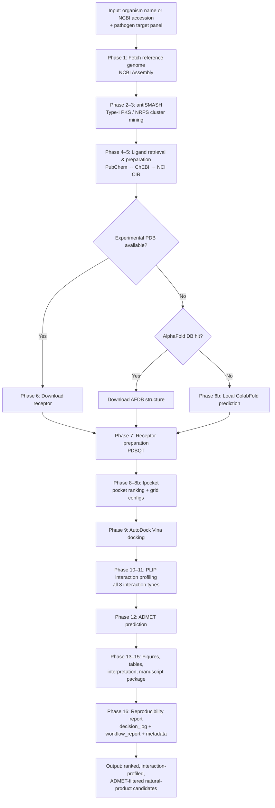

<div align="center">

# PKS_DOCK

### An Open-Source Pipeline for Genome-Guided Natural-Product Discovery, Pocket-Aware Molecular Docking, Interaction Profiling, and ADMET Prediction

**From biosynthetic gene cluster to ranked, interaction-profiled, ADMET-filtered natural-product candidates — with full decision logging and reproducibility.**

🔗 **Repository:** [github.com/kizito-devbio/PKS_DOCK](https://github.com/kizito-devbio/PKS_DOCK)  
🐳 **Docker:** [hub.docker.com/r/kizitodevbio/pks-dock](https://hub.docker.com/r/kizitodevbio/pks-dock)

[](LICENSE)
[](https://www.python.org/)
[](https://github.com/kizito-devbio/PKS_DOCK)
[](https://hub.docker.com/r/kizitodevbio/pks-dock)
[](https://github.com/kizito-devbio/PKS_DOCK)
[](https://github.com/kizito-devbio/PKS_DOCK/stargazers)

</div>

---

## Table of Contents

- [Quick Start](#quick-start)
- [Key Features](#key-features)
- [Why PKS_DOCK](#why-pks_dock)
- [What Makes This a Pipeline, Not a Script Collection](#what-makes-this-a-pipeline-not-a-script-collection)
- [Architecture](#architecture)
- [Pipeline Phases](#pipeline-phases)
- [Example Use Case](#example-use-case)
- [Requirements](#requirements)
- [Installation](#installation)
- [Running with Docker](#running-with-docker)
- [Usage](#usage)
- [Configuration](#configuration)
- [Outputs](#outputs)
- [Reproducibility & Provenance](#reproducibility--provenance)
- [Testing](#testing)
- [Known Limitations](#known-limitations)
- [Roadmap](#roadmap)
- [Frequently Asked Questions](#frequently-asked-questions)
- [Contributing](#contributing)
- [Acknowledgments](#acknowledgments)
- [License](#license)
- [Citation](#citation)
- [Contact](#contact)

---

## Quick Start

```bash
# Option A — Docker (recommended for full reproducibility)
docker pull kizitodevbio/pks-dock:0.2.0
git clone https://github.com/kizito-devbio/PKS_DOCK.git
cd PKS_DOCK
./run_pipeline.sh --organism "Bacillus velezensis" \
  --pathogens Staphylococcus_aureus Bacillus_cereus Pseudomonas_aeruginosa \
  --threads 8

# Option B — Local install
git clone https://github.com/kizito-devbio/PKS_DOCK.git
cd PKS_DOCK
conda env create -f environment.yml
conda activate pksdock
pks-dock --organism "Bacillus velezensis" \
  --pathogens Staphylococcus_aureus Bacillus_cereus Pseudomonas_aeruginosa \
  --threads 8
```

---

## Key Features

- 🧬 **Genome-guided natural-product mining** — antiSMASH-based Type-I PKS / NRPS cluster detection from reference or user-supplied genomes
- 📦 **Automated compound retrieval** — PubChem → ChEBI → NCI CIR fallback chain with documented provenance
- 🎯 **Pocket-aware docking** — fpocket-derived grid boxes (not ligand-centred assumptions)
- 🧪 **Full interaction profiling** — all 8 PLIP interaction types (H-bonds, hydrophobic, salt bridges, water bridges, π-stacking, π-cation, halogen, metal)
- 💊 **ADMET filtering** — Lipinski and related property assessment of docked candidates
- 📊 **Publication-ready outputs** — figures (300 DPI), tables, prose interpretation report, manuscript package
- 📜 **Decision logging** — every automated choice written to `decision_log.json` and `workflow_report.md`
- 🐳 **Docker + Conda** — containerised end-to-end run or local installable CLI (`pks-dock`)
- 🔁 **Crash-safe provenance** — reproducibility artefacts finalised even if a phase fails mid-run

---

## Why PKS_DOCK

Natural-product discovery from antimicrobial-producing bacteria often stalls when isolate genomes are unavailable or incomplete. Researchers then face a fragmented workflow: genome mining in one tool, compound lookup in another, docking in a third, interaction analysis in a fourth — with dozens of undocumented decisions along the way.

**PKS_DOCK** was built for that gap. It takes a producer organism (or NCBI accession) and a configurable panel of pathogen targets, then runs a complete chain:

1. Resolve a reference genome  
2. Mine Type-I PKS / NRPS biosynthetic gene clusters  
3. Retrieve predicted natural-product structures  
4. Prepare receptors (PDB or AlphaFold DB / ColabFold)  
5. Detect druggable pockets with fpocket  
6. Dock, profile interactions, and filter by ADMET  
7. Emit figures, tables, interpretation text, and full decision logs  

Every step records *what* was chosen and *why*, so results remain auditable for thesis defence, peer review, or reuse in low-resource settings.

---

## What Makes This a Pipeline, Not a Script Collection

| Decision point | Manual approach | What PKS_DOCK automates |
| --- | --- | --- |
| Reference genome | Search NCBI by hand | NCBI Assembly search; best reference/representative selected and logged |
| Ligand structure | PubChem / ChEBI / papers by hand | Cascading retrieval: PubChem PUG-REST → ChEBI → NCI CIR |
| Receptor structure | Download PDB or run ColabFold yourself | PDB preferred; AlphaFold DB checked before local ColabFold |
| Docking box | Centre on co-crystallised ligand (often already removed) | **fpocket** pocket detection → grid from top-ranked pocket coordinates |
| Interaction types | Often only H-bonds / hydrophobic | All 8 PLIP types parsed and reported |
| Provenance | Terminal notes, if any | `decision_log.json`, `workflow_report.md`, `pipeline_metadata.json` |
| Failure recovery | Restart from scratch | Incremental decision log survives partial runs |

---

## Architecture

The diagram below is the real control flow. Every box corresponds to an implemented phase or decision in `run_pipeline_container.sh` and the `scripts/` directory.



> **Note:** GitHub renders Mermaid diagrams natively. If your viewer does not, the same flow is described in the [Pipeline Phases](#pipeline-phases) table below.

---

## Pipeline Phases

| Phase | Script | Function |
| --- | --- | --- |
| 0 | `00_clean_workspace.sh` | Optional workspace reset |
| 1 | `01_fetch_genome.py` | Resolve and download reference genome (NCBI Assembly) |
| 2 | `02_run_antismash.sh` | antiSMASH biosynthetic gene-cluster detection |
| 3 | `03_parse_antismash.py` | Parse clusters; extract predicted compound names |
| 4 | `04_get_ligands.py` | Retrieve ligand structures (PubChem → ChEBI → NCI CIR) |
| 5 | `05_prep_ligands.sh` | Ligand preparation → PDBQT |
| 6 | `06_get_receptors.py` | Fetch experimental PDB structures where available |
| 6b | `06b_predict_receptors.py` | AlphaFold DB check → ColabFold fallback; UniProt sequence fetch |
| 7 | `07_prep_receptors.sh` | Receptor cleaning and PDBQT conversion |
| 8 | `08_run_fpocket.sh` | Pocket detection and ranking |
| 8b | `08b_generate_grid_configs.py` | Derive Vina grid centre/size from top pockets |
| 9 | `09_run_docking.sh` | AutoDock Vina docking |
| 10 | `10_run_plip.py` | PLIP interaction analysis |
| 11 | `11_parse_plip.py` | Parse all 8 interaction types into structured tables |
| 12 | `12_run_admet.py` | ADMET / Lipinski-style filtering |
| 13 | `13_generate_figures.py` | Publication-ready figures (300 DPI) |
| 14 | `14_generate_interpretation.py` | Prose Markdown interpretation from real result numbers |
| 15 | `15_generate_manuscript_package.py` | Manuscript / supplementary export package |
| 16 | `16_generate_reproducibility_report.py` | Final decision log, workflow report, metadata |

---

## Example Use Case

PKS_DOCK was developed in the context of antimicrobial discovery from Nigerian fermented foods and natural spring water, where isolate whole-genome sequencing was unavailable. Using *Bacillus velezensis* FZB42 as a reference genome, the pipeline:

1. Mines Type-I PKS clusters (e.g. fengycin, bacillaene, difficidin, macrolactin H)  
2. Retrieves compound structures  
3. Docks against pathogen targets (e.g. *B. cereus* MurA)  
4. Profiles interactions and applies ADMET filters  

Results such as predicted binding affinities and Lipinski compliance are treated as **hypotheses requiring experimental validation**, not as confirmed activity.

---

## Requirements

**Hardware**
- 8+ CPU cores recommended (Vina and antiSMASH benefit from parallelism)
- 16 GB RAM minimum; 32 GB+ recommended for ColabFold / large receptors
- Disk space for genomes, antiSMASH databases, and docking outputs

**Software**
- Docker 24+ (recommended path), **or**
- Miniconda / Anaconda + the tools listed in `environment.yml` (antiSMASH, AutoDock Vina, fpocket, PLIP, Open Babel, etc.)
- Git

---

## Installation

### Local (Conda)

```bash
git clone https://github.com/kizito-devbio/PKS_DOCK.git
cd PKS_DOCK
conda env create -f environment.yml
conda activate pksdock
```

This installs the `pks-dock` package (`pip install -e .`) and exposes the `pks-dock` CLI.

Without conda:

```bash
pip install -e ".[dev]"
```

Before publication, regenerate a lock file from your tested install (see the note in `environment.yml`).

### Development tooling

```bash
pip install -e ".[dev]"
pytest tests/ -v
ruff check src/ tests/
black --check src/ tests/
```

---

## Running with Docker

The published image bundles the full tool stack:

```bash
docker pull kizitodevbio/pks-dock:0.2.0
```

From a clone of this repository:

```bash
./run_pipeline.sh --organism "Bacillus velezensis" \
  --pathogens Staphylococcus_aureus Bacillus_cereus Pseudomonas_aeruginosa \
  --threads 8
```

`run_pipeline.sh` mounts the project directory into the container so that `results/` and `logs/` are written on the host. Override the image tag if needed:

```bash
export PKS_DOCK_IMAGE=kizitodevbio/pks-dock:0.2.0
./run_pipeline.sh --accession GCF_000063585.1 --pathogens Staphylococcus_aureus
```

---

## Usage

### CLI (`pks-dock`)

```bash
pks-dock --organism "Bacillus velezensis" \
  --pathogens Staphylococcus_aureus Bacillus_cereus Pseudomonas_aeruginosa \
  --threads 8 \
  --exhaustiveness 16 \
  --num-modes 9 \
  --cpu 8
```

| Argument | Default | Description |
| --- | --- | --- |
| `--organism` | — | Producer organism name (NCBI Assembly search) |
| `--accession` | — | Specific NCBI genome accession (if known) |
| `--pathogens` | **required** | One or more keys from `config/pathogen_targets.yaml` |
| `--threads` | `4` | Threads for supported steps |
| `--exhaustiveness` | `16` | AutoDock Vina exhaustiveness |
| `--num-modes` | `9` | Docking poses per run |
| `--cpu` | `8` | CPUs passed to docking |
| `--version` | — | Print version and exit |

Supply either `--organism` or `--accession`.

### Direct pipeline script

Inside the container (or a fully provisioned local environment):

```bash
./run_pipeline_container.sh \
  --accession GCF_000063585.1 \
  --pathogens Staphylococcus_aureus \
  --threads 8
```

Every phase prints what it is doing and why. A combined log is written to `logs/pipeline_log_<timestamp>.txt`. Automated decisions are written to:

- `results/reports/decision_log.json` — machine-readable, crash-safe  
- `results/reports/workflow_report.md` — human-readable narrative  
- `results/reports/pipeline_metadata.json` — software versions, git commit, CLI parameters  

---

## Configuration

Pathogen target panels live in **`config/pathogen_targets.yaml`**.

This file is intentionally human-curated. There is no reliable public API that returns “validated druggable targets for organism X”. Each entry should include candidate PDB IDs (the pipeline selects by resolution) or `predict_if_empty: true` for AlphaFold DB / ColabFold prediction. Always cite the literature that justifies each target.

To add a pathogen:

1. Add a block under the appropriate key.  
2. List `candidate_pdb_ids` or enable structure prediction.  
3. Document the source for each target.

---

## Outputs

```
results/
├── genomes/                 # Downloaded reference genomes
├── antismash/               # antiSMASH cluster reports
├── ligands/  ligands_pdbqt/ # Retrieved and prepared ligands
├── receptors_raw/ receptors_pdbqt/
├── fpocket/                 # Pocket detection (inspect top pockets visually)
├── docking/                 # Vina poses and logs
├── plip/                    # Interaction profiles
├── admet/                   # ADMET / property tables
├── figures/                 # F1–F15, 300 DPI
├── tables/                  # Table01–Table05
└── reports/
    ├── interpretation.md
    ├── decision_log.json
    ├── workflow_report.md
    ├── pipeline_metadata.json
    └── manuscript_package/
```

---

## Reproducibility & Provenance

- **Environment** — `environment.yml` for Conda; Docker image `kizitodevbio/pks-dock:0.2.0` for locked tool versions  
- **Decision log** — every genome choice, PDB selection, ligand database fallback, AlphaFold DB hit/miss, and pocket ranking is recorded  
- **Workflow report** — same decisions rendered as a phase-by-phase Markdown narrative  
- **Pipeline metadata** — software versions, git commit, platform, exact CLI flags  
- **Crash safety** — the `pks-dock` CLI finalises metadata and the workflow report even when a phase exits non-zero  

To reproduce a run, use the same Docker tag (or the same Conda environment) and the same `--organism` / `--accession` / `--pathogens` / `--exhaustiveness` values recorded in `pipeline_metadata.json`.

---

## Testing

Offline unit tests cover networking, AlphaFold DB logic, and reproducibility helpers:

```bash
pytest tests/ -v
# tests/test_net.py          — retry, backoff, cache, fallback_chain
# tests/test_alphafold.py    — AFDB hit / miss / error handling
# tests/test_reproducibility.py
# tests/test_vina_parsing.sh — Vina log score-parsing fix
```

CI runs lint and these tests on every push/PR (`.github/workflows/ci.yml`).

External tools (antiSMASH, Vina, fpocket, PLIP, ColabFold) are not executed in the sandboxed unit-test environment. Validate a full end-to-end run on your machine before relying on results for publication or a thesis chapter.

---

## Known Limitations

1. **Target panels are config-driven, not auto-discovered.** Justify each target in the literature and keep citations with the config.  
2. **Genome resolution is automatic but should be sanity-checked** against the assembly you would cite.  
3. **fpocket ranking is used as-is.** Always inspect the top 2–3 pockets for receptors with multiple plausible sites.  
4. **Docking scores prioritise candidates; they do not prove inhibition.** Treat results as hypotheses for experimental follow-up (enzyme assays, MIC, structural studies).  
5. **Full end-to-end runs depend on local tool versions.** Unit tests cover parsing and network logic; they do not replace a real run against your installed antiSMASH / Vina / fpocket stack.

---

## Roadmap

- Optional ensemble docking across multiple receptor conformations  
- Expanded ligand-database cascade (e.g. additional natural-product resources)  
- Propagation of AlphaFold pLDDT into pocket / docking confidence labels  
- Continuous integration regression tests against reference docking outputs  
- Streamlined single-organism quick-start profiles for teaching and workshops  

---

## Frequently Asked Questions

**Do I need my own isolate genomes?**  
No. PKS_DOCK is designed for reference-genome-based analysis when isolate WGS is unavailable. You can still supply a specific accession if you have one.

**Can I use experimental structures only?**  
Yes. When PDBs are listed in the config, they are preferred. AlphaFold DB / ColabFold run only when no suitable experimental structure is available.

**Why fpocket instead of centring on a co-crystallised ligand?**  
Co-crystallised ligands are often stripped during receptor preparation. Pocket detection from the receptor surface is the defensible default for apo or predicted structures.

**Is the ADMET step a full pharmacokinetic model?**  
No. It applies practical filters (e.g. Lipinski-related rules) to prioritise candidates. It is not a substitute for experimental ADMET studies.

**How is this different from ResiDock?**  
ResiDock starts from resistance genes / AI-predicted AMR targets and focuses on inhibitor prioritisation against those targets. PKS_DOCK starts from producer genomes, mines biosynthetic clusters, and docks the predicted natural products against pathogen targets. Complementary tools, different scientific questions.

---

## Contributing

Contributions, issues, and pull requests are welcome. For larger changes (new phases, new databases, new decision rules), open an issue first so the evidence-aware logic stays consistent.

Ground rules (see `CONTRIBUTING.md`):

- No fabricated science or silent hardcoded IDs  
- External HTTP calls go through `pks_dock.net.HTTPClient`  
- Every automated choice is logged  

---

## Acknowledgments

PKS_DOCK orchestrates established open-source tools; credit for the underlying methods belongs to their authors and communities:

- [antiSMASH](https://antismash.secondarymetabolites.org/) — biosynthetic gene-cluster mining  
- [AutoDock Vina](https://vina.scripps.edu/) — molecular docking  
- [fpocket](https://github.com/Discngine/fpocket) — cavity detection  
- [PLIP](https://github.com/pharmai/plip) — protein–ligand interaction profiling  
- [AlphaFold](https://alphafold.ebi.ac.uk/) / [ColabFold](https://github.com/sokrypton/ColabFold) — structure prediction  
- [Open Babel](https://openbabel.org/) — chemical file conversion  
- [Biopython](https://biopython.org/) — sequence and structure utilities  
- PubChem, ChEBI, UniProt, NCBI — data resources  

---

## License

MIT License. See [LICENSE](LICENSE) for details.

---

## Citation

If you use this pipeline, please cite the underlying tools it wraps, and this repository:

```bibtex
@software{pks_dock,
  author = {Sylvester-Ali, Kizito Ibeojo},
  title  = {PKS_DOCK: Genome-guided natural-product discovery with pocket-aware docking, interaction profiling, and ADMET prediction},
  year   = {2026},
  url    = {https://github.com/kizito-devbio/PKS_DOCK},
  version = {0.2.0}
}
```

A DOI via Zenodo is recommended once you freeze a release for a thesis or paper.

---

## Contact

**Kizito Ibeojo Sylvester-Ali**  
Email: [kizitosylvesterali@gmail.com](mailto:kizitosylvesterali@gmail.com)  
GitHub: [github.com/kizito-devbio](https://github.com/kizito-devbio)  
Repository: [github.com/kizito-devbio/PKS_DOCK](https://github.com/kizito-devbio/PKS_DOCK)  
Docker: [hub.docker.com/r/kizitodevbio/pks-dock](https://hub.docker.com/r/kizitodevbio/pks-dock)

Contributions, issues, and pull requests are welcome.
